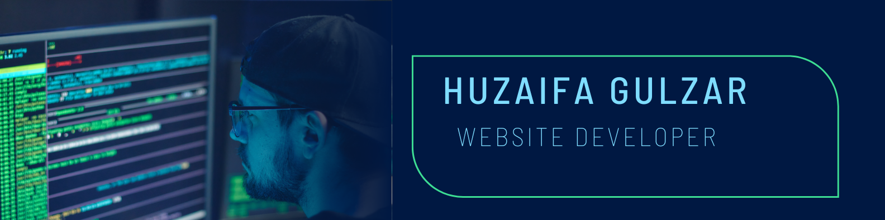

<h1 align="center">Hi 👋, I'm Huzaifa Gulzar</h1>
<h3 align="center">A passionate Web developer from Pakistan</h3>

  

- 🔭 I’m currently working on [Laravel](https://github.com/Huzaifag/Notes_app)

- 🌱 I’m currently learning **Integrating TailwindCSS + React js in Laravel projects for seamless styling with Blade and Livewire components**

- 👯 I’m looking to collaborate on **Building RESTful APIs with Laravel and integrating them with modern JavaScript frameworks like React**

- 🤝 I’m looking for help with **Exploring Server-Side Rendering (SSR) with React and Laravel**

- 👨‍💻 All of my projects are available at [https://huzaifag.github.io/Protfolio/](https://huzaifag.github.io/Protfolio/)

- 📝 I regularly write articles on [https://huzaifag.github.io/Protfolio/](https://huzaifag.github.io/Protfolio/)

- 💬 Ask me about **Building full-stack applications with Laravel and React**

- 📫 How to reach me **huzaifa6715@gmail.com**

- 📄 Know about my experiences [https://drive.google.com/file/d/1vyJ0pk98mnQ-HDkKhQy_Vu-QBUf5oZbX/view?usp=sharing](https://drive.google.com/file/d/1vyJ0pk98mnQ-HDkKhQy_Vu-QBUf5oZbX/view?usp=sharing)

- ⚡ Fun fact **I once built a fully functional Laravel app in a weekend while binge-watching a whole season of my favorite show. I believe in the power of multitasking (and a bit of caffeine)!**

<h3 align="left">Connect with me:</h3>

<h3 align="left">Languages and Tools:</h3>

               

&nbsp;

